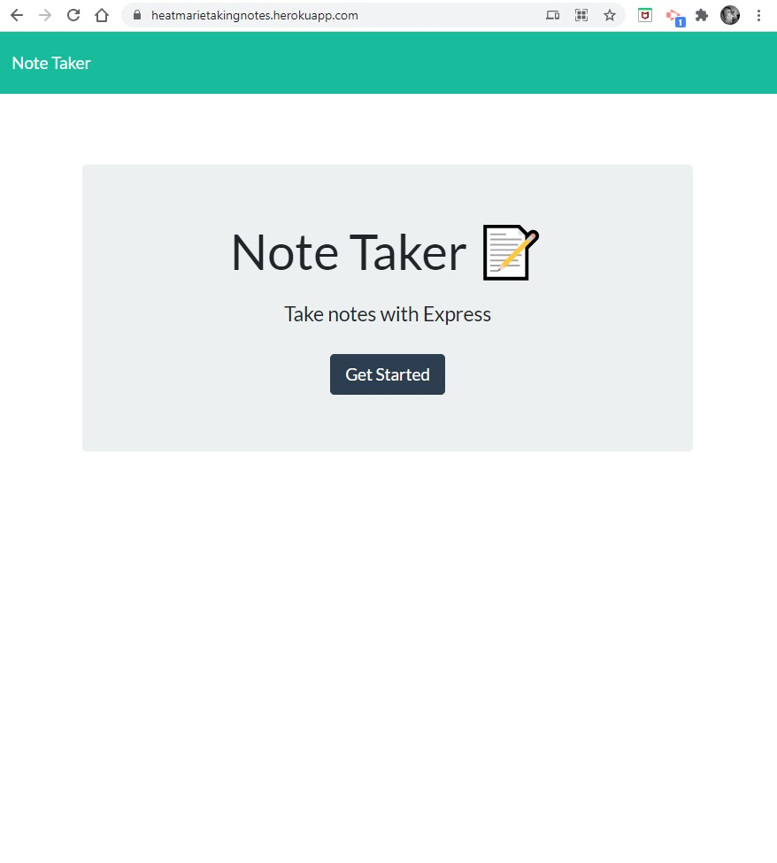
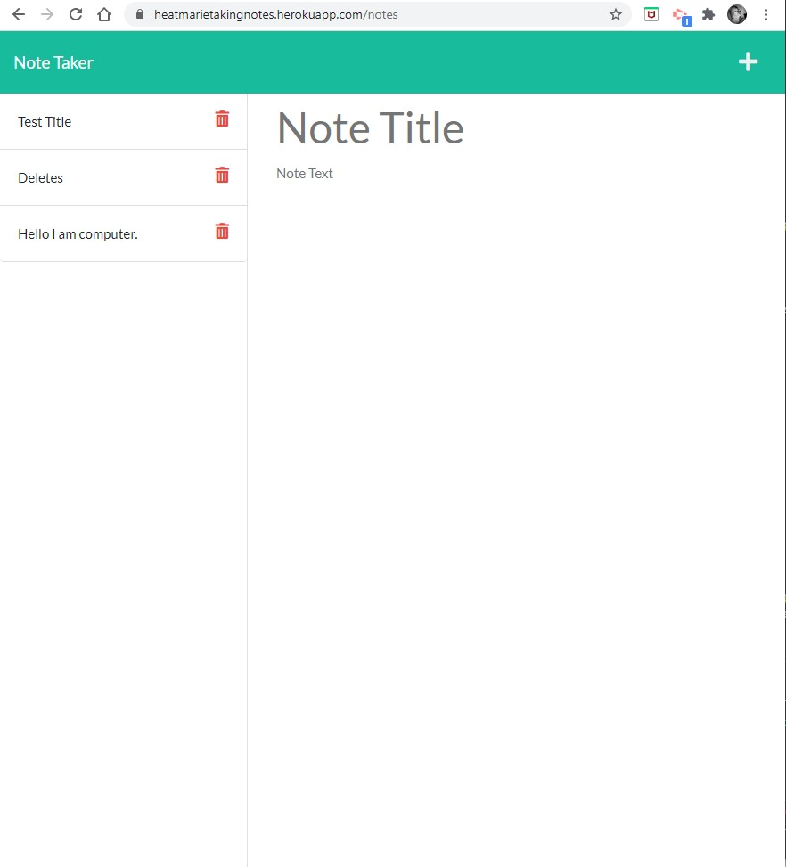

# noteTaker
That thing you can create so you can take notes and forget to use them. 

  ## Table of Contents
  * [The Assignment](##Assignment)
  * [Installation](#installation)
  * [Comments](#comments)
  * [Technologies](#technologies)
  * [Questions](#questions) 
  * [License](#license)

## Assignment

### Express.js: Note Taker 

#### Task

- Modify starter code to create a note taking application that uses Express.js back end.

- This app should save and retrieve note data from a JSON file. (which it does ;D)  

## Installation

There is no installation needed to use this app. For npm packages used to create the app see technologies. 

## The Results

## Link to Demo 

https://heatmarietakingnotes.herokuapp.com/

## Comments 

Here it is, another thing I should, but will never use. A note taker. Besides the delete, which I still can not get, the hardest "required" part of this was figuring out how and where to place the files. Do I create a server.js? Do I need a folder for routes and one for the HTML and one for the APIs. And that is what I did. 

I used Node.js express, to create the server, and the APIs. Then used uuid package to create a unique id for each note. 

## Technologies
- Node.js
- npm
    - express
    - uuid

## Contact Information 

### Heather Bjoin 

  ### For any questions or comments feel free to contact me by using the email below.
  
  <a href="mailto:h.m.bjoin@gmail.com">Email</a>

  ### To see more of my projects: 

  <a href="https://github.com/HeatMarie">Github</a>

## License
  
  
                MIT License

          Copyright (c) 2021, Heather Bjoin

          Permission is hereby granted, free of charge, to any person obtaining a copy
          of this software and associated documentation files (the "Software"), to deal
          in the Software without restriction, including without limitation the rights
          to use, copy, modify, merge, publish, distribute, sublicense, and/or sell
          copies of the Software, and to permit persons to whom the Software is
          furnished to do so, subject to the following conditions:

          The above copyright notice and this permission notice shall be included in all
          copies or substantial portions of the Software.

          THE SOFTWARE IS PROVIDED "AS IS", WITHOUT WARRANTY OF ANY KIND, EXPRESS OR
          IMPLIED, INCLUDING BUT NOT LIMITED TO THE WARRANTIES OF MERCHANTABILITY,
          FITNESS FOR A PARTICULAR PURPOSE AND NONINFRINGEMENT. IN NO EVENT SHALL THE
          AUTHORS OR COPYRIGHT HOLDERS BE LIABLE FOR ANY CLAIM, DAMAGES OR OTHER
          LIABILITY, WHETHER IN AN ACTION OF CONTRACT, TORT OR OTHERWISE, ARISING FROM,
          OUT OF OR IN CONNECTION WITH THE SOFTWARE OR THE USE OR OTHER DEALINGS IN THE
          SOFTWARE.
